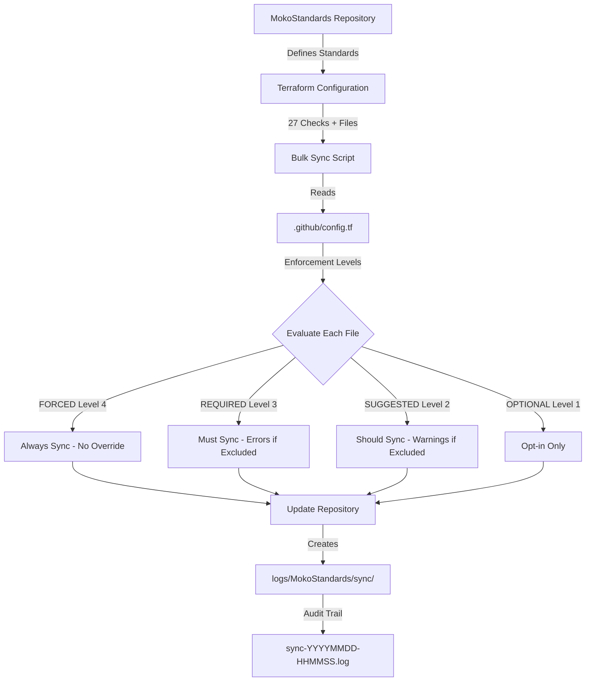

<!--
Copyright (C) 2026 Moko Consulting <hello@mokoconsulting.tech>

This file is part of a Moko Consulting project.

SPDX-License-Identifier: GPL-3.0-or-later

This program is free software; you can redistribute it and/or modify
it under the terms of the GNU General Public License as published by
the Free Software Foundation; either version 3 of the License, or
(at your option) any later version.

This program is distributed in the hope that it will be useful,
but WITHOUT ANY WARRANTY; without even the implied warranty of
MERCHANTABILITY or FITNESS FOR A PARTICULAR PURPOSE. See the
GNU General Public License for more details.

You should have received a copy of the GNU General Public License
along with this program. If not, see <https://www.gnu.org/licenses/>.

# FILE INFORMATION
DEFGROUP: MokoStandards.Training
INGROUP: MokoStandards.Documentation
REPO: https://github.com/mokoconsulting-tech/MokoStandards
PATH: docs/training/session-7-terraform-infrastructure.md
VERSION: 04.00.03
BRIEF: Training Session 7 - Terraform Infrastructure and Configuration Management
-->

[](https://github.com/mokoconsulting-tech/MokoStandards)

# Session 7: Terraform Infrastructure and Configuration Management

**Duration**: 3.0 hours  
**Prerequisites**: Sessions 1-6  
**Format**: Lecture + Hands-on Lab  
**Difficulty**: Intermediate

---

## 📋 Session Overview

This session introduces Terraform as used in MokoStandards for infrastructure as code, repository management, and bulk synchronization. You'll learn the six-tier enforcement level system, override configuration, and how to manage infrastructure declaratively.

**What You'll Learn**:
- Terraform file structure standards
- six-tier enforcement levels (Optional, Suggested, Required, Forced)
- **How terraform enforces organizational standards** ⭐ NEW
- Standards-compliance integration and automation
- Override configuration system (.github/config.tf)
- Bulk repository synchronization
- Infrastructure management patterns
- Repository automation
- Configuration validation

**What You'll Build**:
- Custom override configuration
- Infrastructure module
- Repository management workflow
- Automated sync scripts

---

## 🎯 Learning Objectives

By the end of this session, you will be able to:

1. ✅ Understand MokoStandards terraform file structure
2. ✅ Apply the six enforcement levels correctly
3. ✅ Create and configure .github/config.tf files
4. ✅ Use bulk synchronization effectively
5. ✅ Manage repository infrastructure with terraform
6. ✅ Validate terraform configurations
7. ✅ Debug sync and enforcement issues

---

## 📚 Part 1: Terraform File Structure Standards (30 minutes)

### 1.1 Standard Structure Overview

All terraform files in MokoStandards follow a consistent structure:

```terraform
# Copyright (C) 2026 Moko Consulting <hello@mokoconsulting.tech>
# [Full GPL-3.0-or-later header...]

# FILE INFORMATION
# DEFGROUP: MokoStandards.Infrastructure
# INGROUP: MokoStandards.Terraform
# REPO: https://github.com/mokoconsulting-tech/MokoStandards
# PATH: /terraform/main.tf
# VERSION: 04.00.03
# BRIEF: Main terraform configuration

locals {
  file_metadata = {
    name              = "Main Configuration"
    description       = "Primary terraform configuration"
    version           = "04.00.03"
    last_updated      = "2026-02-21T00:00:00Z"
    maintainer        = "MokoStandards Team"
    schema_version    = "2.0"
    repository_url    = "https://github.com/mokoconsulting-tech/MokoStandards"
    file_type         = "main"  # main|variables|outputs|override|module
    terraform_version = ">= 1.0"
  }
}

# Rest of terraform configuration...
```

### 1.2 File Types

| Type | Purpose | file_type | Location |
|------|---------|-----------|----------|
| **Main** | Primary configuration | `"main"` | `terraform/main.tf` |
| **Variables** | Input definitions | `"variables"` | `terraform/variables.tf` |
| **Outputs** | Output definitions | `"outputs"` | `terraform/outputs.tf` |
| **Override** | Sync overrides | `"override"` | `.github/config.tf` |
| **Module** | Reusable modules | `"module"` | `terraform/modules/` |

### 1.3 Required Elements

1. ✅ GPL-3.0-or-later copyright header
2. ✅ FILE INFORMATION section
3. ✅ file_metadata locals block
4. ✅ Version 04.00.03
5. ✅ ISO 8601 timestamps
6. ✅ Schema version 2.0

### 📝 Exercise 1.1: Create a Terraform Module (10 minutes)

Create a new terraform module following standards:

```bash
# Create module directory
mkdir -p terraform/modules/example-module

# Create module file
cat > terraform/modules/example-module/main.tf << 'EOF'
# Copyright (C) 2026 Moko Consulting <hello@mokoconsulting.tech>
# [Add full header...]

# FILE INFORMATION
# DEFGROUP: MokoStandards.Modules.Example
# INGROUP: MokoStandards.Terraform
# REPO: https://github.com/mokoconsulting-tech/MokoStandards
# PATH: /terraform/modules/example-module/main.tf
# VERSION: 04.00.03
# BRIEF: Example terraform module

locals {
  file_metadata = {
    name              = "Example Module"
    description       = "Example terraform module for training"
    version           = "04.00.03"
    last_updated      = "2026-02-21T00:00:00Z"
    maintainer        = "Training Participant"
    schema_version    = "2.0"
    repository_url    = "https://github.com/mokoconsulting-tech/MokoStandards"
    file_type         = "module"
    terraform_version = ">= 1.0"
  }
}

variable "example_input" {
  description = "Example input variable"
  type        = string
}

output "example_output" {
  description = "Example output value"
  value       = "Processed: ${var.example_input}"
}
EOF

# Validate syntax
terraform validate
```

**Expected Output**:
```
Success! The configuration is valid.
```

---

## 🎚️ Part 2: six-tier enforcement Level System (45 minutes)

### 2.1 Enforcement Levels Overview

MokoStandards uses four levels to balance standards with flexibility:

| Level | Name | Symbol | Behavior |
|-------|------|--------|----------|
| 1 | OPTIONAL | ⭕ | May be synced (opt-in) |
| 2 | SUGGESTED | ⚠️ | Should be synced (warnings) |
| 3 | REQUIRED | ⛔ | Must be synced (errors) |
| 4 | FORCED | 🔒 | Always synced (cannot override) |

### 2.2 Level 1: OPTIONAL ⭕

**Characteristics**:
- Not created by default
- Requires explicit opt-in
- No warnings if excluded
- No compliance impact

**Example**:
```terraform
enforcement_levels = {
  optional_files = [
    {
      path    = ".github/workflows/deploy-to-staging.yml"
      reason  = "Only for repositories with staging environment"
      include = true  # Explicitly opt in
    },
    {
      path    = ".github/workflows/performance-testing.yml"
      reason  = "Performance testing not needed for all projects"
      include = false  # Explicitly opt out
    }
  ]
}
```

**Use Cases**:
- Optional features (staging, performance testing)
- Environment-specific configurations
- Experimental workflows
- Advanced tooling

### 2.3 Level 2: SUGGESTED ⚠️

**Characteristics**:
- Created by default
- Warnings if excluded
- Can be overridden with justification
- May impact compliance scoring

**Example**:
```terraform
enforcement_levels = {
  suggested_files = [
    {
      path   = ".github/workflows/dependency-review.yml"
      reason = "Recommended security practice for dependency scanning"
    },
    {
      path   = ".github/workflows/codeql-analysis.yml"
      reason = "Recommended for code security scanning"
    },
    {
      path   = ".editorconfig"
      reason = "Recommended for consistent code formatting"
    }
  ]
}
```

**Use Cases**:
- Security best practices
- Recommended workflows
- Standard configurations
- Quality assurance tools

### 2.4 Level 3: REQUIRED ⛔

**Characteristics**:
- Always created
- Cannot be excluded
- Errors if missing
- Ignores protected_files
- Compliance failure if absent

**Example**:
```terraform
enforcement_levels = {
  required_files = [
    {
      path   = ".github/workflows/ci.yml"
      reason = "Continuous integration is mandatory"
    },
    {
      path   = "LICENSE"
      reason = "License file required for all repositories"
    },
    {
      path   = "CONTRIBUTING.md"
      reason = "Contributing guidelines required"
    }
  ]
}
```

**Use Cases**:
- License files
- Contributing guidelines
- Required workflows (CI/CD)
- Mandatory documentation

### 2.5 Level 4: FORCED 🔒

**Characteristics**:
- Always synced
- Cannot be excluded or protected
- Overrides ALL config.tf settings
- Critical compliance files

**FORCED Files** (Defined in Code):
1. `.github/workflows/standards-compliance.yml`
2. `scripts/validate/check_version_consistency.php`
3. `scripts/validate/check_enterprise_readiness.php`
4. `scripts/validate/check_repo_health.php`
5. `scripts/maintenance/validate_script_registry.py`
6. `scripts/.script-registry.json`

**Example**:
```terraform
# These are documented for reference only
# They CANNOT be overridden in config.tf
enforcement_levels = {
  forced_files = [
    {
      path   = ".github/workflows/standards-compliance.yml"
      reason = "Critical: Organization-wide compliance checks"
    }
  ]
}

# Attempting to protect FORCED files is IGNORED
protected_files = [
  {
    path   = ".github/workflows/standards-compliance.yml"
    reason = "Custom implementation"  # This will be IGNORED
  }
]
```

**Use Cases**:
- Critical security files
- Organization-wide compliance
- Essential validation scripts
- Core infrastructure

### 2.6 Decision Tree

```
┌─────────────────────────────────────┐
│ Is file critical for security or   │
│ organization-wide compliance?       │
└─────────────┬───────────────────────┘
              │
              ├─ YES ─→ Level 4: FORCED 🔒
              │
              └─ NO
                 │
                 ┌────────────────────────────────┐
                 │ Is file mandatory for all      │
                 │ repositories to function?      │
                 └──────────┬─────────────────────┘
                            │
                            ├─ YES ─→ Level 3: REQUIRED ⛔
                            │
                            └─ NO
                               │
                               ┌──────────────────────────────┐
                               │ Is file a recommended        │
                               │ best practice?               │
                               └──────────┬───────────────────┘
                                          │
                                          ├─ YES ─→ Level 2: SUGGESTED ⚠️
                                          │
                                          └─ NO ─→ Level 1: OPTIONAL ⭕
```

### 📝 Exercise 2.1: Classify Files by Enforcement Level (15 minutes)

Classify the following files into appropriate enforcement levels:

1. `.github/workflows/nightly-builds.yml` - Builds every night
2. `.github/workflows/security-scan.yml` - Security scanning
3. `README.md` - Repository documentation
4. `.github/workflows/experimental-ci.yml` - New CI approach being tested
5. `SECURITY.md` - Security policy
6. `.github/workflows/standards-compliance.yml` - Compliance checks

**Solution**:
```terraform
enforcement_levels = {
  optional_files = [
    {
      path    = ".github/workflows/nightly-builds.yml"
      reason  = "Not all projects need nightly builds"
      include = false
    },
    {
      path    = ".github/workflows/experimental-ci.yml"
      reason  = "Experimental feature - opt-in"
      include = false
    }
  ]
  
  suggested_files = [
    {
      path   = ".github/workflows/security-scan.yml"
      reason = "Security scanning is recommended"
    },
    {
      path   = "SECURITY.md"
      reason = "Security policy recommended"
    }
  ]
  
  required_files = [
    {
      path   = "README.md"
      reason = "Documentation is mandatory"
    }
  ]
  
  forced_files = [
    {
      path   = ".github/workflows/standards-compliance.yml"
      reason = "Critical compliance checks - always enforced"
    }
  ]
}
```

---

## 🛡️ Part 2.5: How Terraform Enforces Standards (25 minutes)

### 2.5.1 Standards Enforcement Overview

**Key Concept**: Terraform configuration serves as the **enforcement mechanism** for organizational standards across all repositories.

**How It Works**:
1. **Define** standards in MokoStandards repository
2. **Configure** enforcement levels in terraform
3. **Sync** standards to all repositories via bulk sync
4. **Validate** compliance with 27 automated checks
5. **Audit** all operations via remote logging

### 2.5.2 Integration with Standards-Compliance Workflow

MokoStandards includes a comprehensive **standards-compliance.yml** workflow with **27 validation checks**:

**Security Checks** (5):
- Secret scanning (prevents credential leaks)
- Dependency vulnerability scanning
- Insecure code pattern detection
- Script integrity validation (SHA-256 hashes)
- Binary file detection

**Quality Checks** (7):
- Coding standards (linters for YAML, PHP, Python)
- Line length validation
- Code duplication detection
- Code complexity analysis
- Dead code detection
- Unused dependencies check
- File naming standards

**Documentation Checks** (6):
- Documentation quality validation
- README completeness (required sections)
- API documentation coverage (>80% target)
- Broken link detection
- TODO/FIXME tracking
- Changelog format validation

**Structure Checks** (5):
- Repository structure validation
- License compliance (GPL-3.0-or-later)
- Git hygiene (commits, branches)
- Workflow validation (actionlint)
- File size limits (1MB warning, 10MB error)

**Metrics Checks** (4):
- Version consistency (04.00.03 everywhere)
- Enterprise readiness assessment
- Repository health scoring
- Performance metrics

**Total**: 10 critical (blocking) + 17 informational (guidance) = **27 checks**

### 2.5.3 The Enforcement Mechanism

**Bulk Sync Process**:



### 2.5.4 six-tier enforcement in Action

**Example 1: FORCED Files (Level 4)**

These 6 files are **ALWAYS** synced, regardless of config.tf:

```terraform
# These cannot be excluded or protected
ALWAYS_FORCE_OVERRIDE_FILES = [
  ".github/workflows/standards-compliance.yml",    # 27 validation checks
  "scripts/validate/check_version_consistency.php", # Version validator
  "scripts/validate/check_enterprise_readiness.php", # Enterprise patterns
  "scripts/validate/check_repo_health.php",        # Health checker
  "scripts/maintenance/validate_script_registry.py", # Script integrity
  "scripts/.script-registry.json"                  # SHA-256 hashes
]
```

**Why**: These files ensure every repository meets minimum security and compliance standards.

**Example Sync Log**:
```
Processing: .github/workflows/standards-compliance.yml
✓ Sync: FORCED (Level 4 - critical compliance - always updated)
  Note: File is protected in config.tf but FORCE_OVERRIDE takes precedence
```

**Example 2: REQUIRED Files (Level 3)**

```terraform
required_files = [
  {
    path   = "LICENSE"
    reason = "GPL-3.0-or-later required for all projects"
  },
  {
    path   = ".github/workflows/ci.yml"
    reason = "Continuous integration is mandatory"
  },
  {
    path   = "CONTRIBUTING.md"
    reason = "Contribution guidelines required"
  }
]
```

**Behavior**:
- **Must be synced** to all repositories
- **Cannot be excluded** in config.tf
- **Errors generated** if missing
- **Blocks compliance** if absent

**Example 3: SUGGESTED Files (Level 2)**

```terraform
suggested_files = [
  {
    path   = ".github/workflows/dependency-review.yml"
    reason = "Security best practice - strongly recommended"
  },
  {
    path   = ".editorconfig"
    reason = "Consistent code formatting across editors"
  }
]
```

**Behavior**:
- **Synced by default**
- **Can be excluded** with justification
- **Warnings generated** if excluded
- **No compliance impact**

**Example 4: OPTIONAL Files (Level 1)**

```terraform
optional_files = [
  {
    path    = ".github/workflows/deploy-staging.yml"
    reason  = "Only needed if repository has staging environment"
    include = true  # Explicit opt-in
  },
  {
    path    = ".github/workflows/performance-testing.yml"
    reason  = "Only for performance-critical applications"
    include = false  # Not needed
  }
]
```

**Behavior**:
- **Not synced by default**
- **Requires explicit opt-in** (include = true)
- **No warnings** if excluded
- **No compliance impact**

### 2.5.5 Real-World Enforcement Example

**Scenario**: API Service Repository

**Config.tf**:
```terraform
enforcement_levels = {
  optional_files = [
    { path = ".github/workflows/deploy-staging.yml", include = true },
    { path = ".github/workflows/load-testing.yml", include = false }
  ]
  
  suggested_files = [
    { path = ".github/workflows/security-scan.yml" },
    { path = ".github/workflows/dependency-review.yml" }
  ]
  
  required_files = [
    { path = "LICENSE" },
    { path = ".github/workflows/ci.yml" },
    { path = "CONTRIBUTING.md" }
  ]
}

protected_files = [
  { path = "package.json", reason = "API-specific dependencies" },
  { path = "src/config/database.php", reason = "Custom DB config" }
]
```

**Sync Output**:
```
=================================================================
Processing: mokoconsulting-tech/my-api-service
=================================================================

[FORCED] .github/workflows/standards-compliance.yml ✓ Sync
  Level 4: Critical compliance file - always updated

[REQUIRED] LICENSE ✓ Sync
  Level 3: Mandatory file - cannot be excluded

[REQUIRED] .github/workflows/ci.yml ✓ Sync
  Level 3: Mandatory file - cannot be excluded

[SUGGESTED] .github/workflows/security-scan.yml ✓ Sync
  Level 2: Recommended best practice

[OPTIONAL] .github/workflows/deploy-staging.yml ✓ Sync
  Level 1: Explicitly opted in

[OPTIONAL] .github/workflows/load-testing.yml ✗ Skip
  Level 1: Not opted in (not needed for this repository)

[PROTECTED] package.json ✗ Skip
  Reason: API-specific dependencies - protected in config.tf

Summary:
- Files Synced: 5
- Files Skipped: 2
- Force-Overridden: 1 (standards-compliance.yml)
- Required Enforced: 2 (LICENSE, ci.yml)
```

### 2.5.6 Compliance Validation Workflow

**End-to-End Process**:

1. **Pre-Sync Validation**
   ```bash
   # Validate config.tf before sync
   terraform validate .github/config.tf
   ```

2. **Bulk Sync with Enforcement**
   ```bash
   php scripts/automation/bulk_update_repos.php \
     --org mokoconsulting-tech \
     --repo my-api-service
   ```

3. **Standards-Compliance Check** (Automatic on PR)
   - 27 validation checks run
   - Critical checks must pass
   - Informational checks provide guidance

4. **Audit Log Creation**
   - Log created at `logs/MokoStandards/sync/sync-YYYYMMDD-HHMMSS.log`
   - Complete audit trail
   - All decisions documented

5. **Compliance Scoring**
   ```
   Critical Checks: 10/10 passed ✓
   Informational: 15/17 passed ⚠
   
   Compliance Score: 100% (all critical checks passed)
   Status: ✅ COMPLIANT
   ```

### 2.5.7 Audit and Logging

**Every sync operation creates detailed logs**:

**Location**: `logs/MokoStandards/sync/` on remote repository

**Files Created**:
1. `sync-YYYYMMDD-HHMMSS.log` - Session log
2. `sync-latest.log` - Most recent (symlink)
3. `sync-summary.json` - Machine-readable

**Log Content**:
```
=================================================================
MokoStandards Bulk Sync Log
=================================================================
Session ID: sync-2026-02-21-073000
Repository: mokoconsulting-tech/my-api-service
MokoStandards Version: 04.00.03
Sync Started: 2026-02-21T07:30:00Z
Sync Completed: 2026-02-21T07:30:45Z
Duration: 45 seconds

OPERATIONS PERFORMED
[07:30:01] Repository sync started
[07:30:03] Validating .github/config.tf - PASSED ✓
[07:30:05] Updating .github/config.tf to version 04.00.03
[07:30:10] Processing 25 files

FILES PROCESSED
[FORCED] .github/workflows/standards-compliance.yml
  Reason: Critical compliance file
  Action: Synced

SUMMARY
Total Files Processed: 25
Files Synced: 18
Files Skipped: 7
Force-Overridden: 6
Validation: PASSED ✓
=================================================================
```

### 2.5.8 Key Takeaways

**Terraform Enforces Standards By**:

1. ✅ **Defining** standards declaratively in terraform configuration
2. ✅ **Classifying** files into 4 enforcement levels
3. ✅ **Synchronizing** standards across all repositories
4. ✅ **Validating** compliance with 27 automated checks
5. ✅ **Force-Overriding** 6 critical compliance files
6. ✅ **Logging** all operations for audit trail
7. ✅ **Scoring** compliance (critical checks must pass)
8. ✅ **Blocking** non-compliant merges (critical checks)

**Benefits**:
- 🔒 **Security**: All repositories meet minimum security standards
- 📊 **Consistency**: Same standards enforced everywhere
- 📝 **Transparency**: Complete audit trail of all changes
- 🎯 **Flexibility**: six enforcement levels balance control vs autonomy
- ⚡ **Automation**: Standards enforcement is automatic
- 🛡️ **Compliance**: 27-point validation ensures quality

**Remember**: Terraform isn't just for infrastructure - it's our **standards enforcement engine**!

---

## 🔧 Part 4: Override Configuration (.github/config.tf) (40 minutes)

### 8.1 Override File Location

**STANDARD**: `.github/config.tf`

**LEGACY** (auto-migrated):
- `MokoStandards.override.tf`
- `override.config.tf`
- `.mokostandards.override.tf`

### 8.2 Complete Override Structure

```terraform
# Copyright (C) 2026 Moko Consulting <hello@mokoconsulting.tech>
# [Full header...]

# FILE INFORMATION
# DEFGROUP: [Project].Override
# INGROUP: [Project].Configuration
# REPO: https://github.com/mokoconsulting-tech/[repo]
# PATH: /.github/config.tf
# VERSION: 04.00.03
# BRIEF: Repository-specific override configuration

locals {
  file_metadata = {
    name              = "[Project] Override Configuration"
    description       = "Override configuration for bulk synchronization"
    version           = "04.00.03"
    last_updated      = "2026-02-21T00:00:00Z"
    maintainer        = "[Team Name]"
    schema_version    = "2.0"
    repository_url    = "https://github.com/mokoconsulting-tech/[repo]"
    file_type         = "override"
    terraform_version = ">= 1.0"
    file_location     = ".github/config.tf"
  }
  
  # Sync configuration
  sync_config = {
    enabled      = true
    cleanup_mode = "conservative"  # none|conservative|aggressive
  }
  
  # Enforcement levels
  enforcement_levels = {
    optional_files = [
      # Level 1: Opt-in files
    ]
    
    suggested_files = [
      # Level 2: Recommended files
    ]
    
    required_files = [
      # Level 3: Mandatory files
    ]
    
    forced_files = [
      # Level 4: Always synced (documented only)
    ]
  }
  
  # Files to exclude from sync
  exclude_files = [
    {
      path   = ".github/workflows/custom-workflow.yml"
      reason = "Repository-specific workflow"
    }
  ]
  
  # Files to protect from overwrite
  protected_files = [
    {
      path   = ".gitignore"
      reason = "Repository-specific ignore patterns"
    }
  ]
  
  # Files to remove during sync
  obsolete_files = [
    {
      path   = "old-script.sh"
      reason = "Deprecated and no longer used"
    }
  ]
}
```

### 8.3 Sync Behavior

**During Bulk Sync**:
1. ✅ Validates config.tf syntax
2. ✅ Updates config.tf version to 04.00.03
3. ✅ Preserves repository-specific sections
4. ✅ Processes files by enforcement level
5. ✅ Logs all decisions with reasons

**Processing Flow**:
```
For each file:
1. Check FORCED (Level 4) → Always sync
2. Check REQUIRED (Level 3) → Must sync (warnings if protected)
3. Check SUGGESTED (Level 2) → Sync unless excluded (warnings)
4. Check OPTIONAL (Level 1) → Sync only if opted in
5. Check exclude_files → Skip if excluded
6. Check protected_files → Skip if protected
```

### 📝 Exercise 3.1: Create Override Configuration (15 minutes)

Create a `.github/config.tf` for a web application project:

**Requirements**:
- Exclude deployment to production workflow (not ready)
- Protect custom .gitignore (project-specific)
- Include staging deployment (optional, opt-in)
- Mark old deploy.sh script as obsolete

**Solution**:
```bash
# Create .github directory if it doesn't exist
mkdir -p .github

# Create config.tf
cat > .github/config.tf << 'EOF'
# Copyright (C) 2026 Moko Consulting <hello@mokoconsulting.tech>
# [Full header...]

# FILE INFORMATION
# DEFGROUP: WebApp.Override
# INGROUP: WebApp.Configuration
# REPO: https://github.com/mokoconsulting-tech/webapp
# PATH: /.github/config.tf
# VERSION: 04.00.03
# BRIEF: Web application override configuration

locals {
  file_metadata = {
    name              = "WebApp Override Configuration"
    description       = "Override configuration for web application"
    version           = "04.00.03"
    last_updated      = "2026-02-21T00:00:00Z"
    maintainer        = "WebApp Team"
    schema_version    = "2.0"
    repository_url    = "https://github.com/mokoconsulting-tech/webapp"
    file_type         = "override"
    terraform_version = ">= 1.0"
    file_location     = ".github/config.tf"
  }
  
  sync_config = {
    enabled      = true
    cleanup_mode = "conservative"
  }
  
  enforcement_levels = {
    optional_files = [
      {
        path    = ".github/workflows/deploy-to-staging.yml"
        reason  = "Web app has staging environment"
        include = true  # Opt in to staging deployment
      }
    ]
  }
  
  exclude_files = [
    {
      path   = ".github/workflows/deploy-production.yml"
      reason = "Production deployment not ready - manual only"
    }
  ]
  
  protected_files = [
    {
      path   = ".gitignore"
      reason = "Contains project-specific ignore patterns for node_modules, dist, etc."
    }
  ]
  
  obsolete_files = [
    {
      path   = "deploy.sh"
      reason = "Old shell script replaced by GitHub Actions workflow"
    }
  ]
}
EOF

# Validate
terraform validate
```

### 📝 Exercise 3.2: Bulk Sync Dry Run (10 minutes)

Test bulk sync with your override configuration:

```bash
# Run bulk sync in dry-run mode
php scripts/automation/bulk_update_repos.php \
  --org mokoconsulting-tech \
  --repo webapp \
  --dry-run

# Expected output:
# Processing repository: mokoconsulting-tech/webapp
# Checking for legacy override files...
# Scanning .github/config.tf...
# ✓ config.tf validation passed
# Updating .github/config.tf...
# ✓ config.tf updated to version 04.00.03
#
# Processing files:
# ✓ Sync .github/workflows/deploy-to-staging.yml: OPTIONAL (Level 1 - explicitly included)
# ✗ Skip .github/workflows/deploy-production.yml: excluded in config.tf
# ✗ Skip .gitignore: protected in config.tf
# ✓ Remove deploy.sh: obsolete (marked for removal)
# ✓ Sync .github/workflows/standards-compliance.yml: FORCED (Level 4 - critical compliance)
```

---

## 🔄 Part 5: Bulk Repository Synchronization (30 minutes)

### 8.1 Sync Process Overview

**bulk_update_repos.php** synchronizes files across multiple repositories:

1. **Discovery**: Find all repositories in organization
2. **Migration**: Auto-migrate legacy override files
3. **Validation**: Scan and validate .github/config.tf
4. **Update**: Update config.tf to latest version
5. **Sync**: Process each file by enforcement level
6. **Cleanup**: Remove obsolete files
7. **Commit**: Create PR with changes

### 8.2 Command Line Usage

```bash
# Basic usage - sync all repos
php scripts/automation/bulk_update_repos.php \
  --org mokoconsulting-tech

# Specific repository
php scripts/automation/bulk_update_repos.php \
  --org mokoconsulting-tech \
  --repo myproject

# Dry run (no changes)
php scripts/automation/bulk_update_repos.php \
  --org mokoconsulting-tech \
  --dry-run

# Skip archived repositories
php scripts/automation/bulk_update_repos.php \
  --org mokoconsulting-tech \
  --skip-archived

# Force update (emergency)
php scripts/automation/bulk_update_repos.php \
  --org mokoconsulting-tech \
  --force-override
```

### 8.3 Sync Output Interpretation

```
Processing repository: mokoconsulting-tech/example
  Checking for legacy override files...
  ✓ Found legacy override file: MokoStandards.override.tf
  Migrating to .github/config.tf...
  ✓ Created .github directory
  ✓ Created .github/config.tf
  ✓ Deleted MokoStandards.override.tf
  ✓ Successfully migrated
  
  Scanning .github/config.tf...
  ⚠ Version outdated - will be updated to 04.00.03
  ⚠ File 'standards-compliance.yml' is protected but marked as FORCE_OVERRIDE
  ✓ config.tf validation passed
  
  Updating .github/config.tf...
  ✓ Updated config.tf to version 04.00.03
  
  Processing files:
  ✓ Sync file1.yml: FORCED (Level 4)
  ⚠ Sync file2.yml: REQUIRED (Level 3 - protected but overridden)
  ✓ Sync file3.yml: SUGGESTED (Level 2)
  ✗ Skip file4.yml: OPTIONAL (Level 1 - not opted in)
  ✗ Skip file5.yml: protected in config.tf
```

**Legend**:
- ✓ Success
- ✗ Skipped (expected)
- ⚠ Warning (review recommended)
- ❌ Error (action required)

### 📝 Exercise 4.1: Run Full Sync (10 minutes)

```bash
# 1. Set GitHub token
export GITHUB_TOKEN="ghp_your_token_here"

# 2. Run sync on test repository
php scripts/automation/bulk_update_repos.php \
  --org mokoconsulting-tech \
  --repo test-repo \
  --dry-run

# 3. Review output and identify:
#    - Which files were synced (FORCED, REQUIRED, SUGGESTED)
#    - Which files were skipped (OPTIONAL, protected, excluded)
#    - Any warnings or errors
#    - Version updates applied

# 4. Check metrics
cat .metrics/bulk_sync_$(date +%Y%m%d).json | jq .
```

---

## 📊 Part 6: Validation and Testing (20 minutes)

### 8.1 Terraform Validation

```bash
# Validate syntax
terraform validate

# Format code
terraform fmt -recursive

# Check formatting
terraform fmt -check -recursive

# Initialize terraform
terraform init

# Plan (dry run)
terraform plan

# Apply (with approval)
terraform apply
```

### 8.2 Config.tf Validation

```bash
# Validate override configuration
cd .github
terraform validate

# Check for syntax errors
terraform fmt -check config.tf

# Lint with yamllint (if available)
yamllint config.tf 2>/dev/null || echo "YAML lint not applicable to .tf files"
```

### 8.3 Testing Sync Logic

```bash
# Test sync with dry-run
php scripts/automation/bulk_update_repos.php \
  --org mokoconsulting-tech \
  --repo test-repo \
  --dry-run \
  --force

# Verify no changes made
git status

# Check logs
tail -f logs/bulk_sync.log
```

### 📝 Exercise 5.1: Validation Workflow (10 minutes)

Create a validation script:

```bash
#!/bin/bash
# validate-terraform.sh

echo "Validating Terraform Configuration..."

# 1. Check terraform is installed
if ! command -v terraform &> /dev/null; then
    echo "❌ Terraform not installed"
    exit 1
fi
echo "✓ Terraform installed: $(terraform version -json | jq -r .terraform_version)"

# 2. Validate main terraform
cd terraform
terraform init -backend=false
terraform validate
if [ $? -ne 0 ]; then
    echo "❌ Main terraform validation failed"
    exit 1
fi
echo "✓ Main terraform validated"
cd ..

# 3. Validate override config
if [ -f .github/config.tf ]; then
    cd .github
    terraform validate
    if [ $? -ne 0 ]; then
        echo "❌ Override config validation failed"
        exit 1
    fi
    echo "✓ Override config validated"
    cd ..
fi

# 4. Check formatting
terraform fmt -check -recursive
if [ $? -ne 0 ]; then
    echo "⚠ Terraform files need formatting (run: terraform fmt -recursive)"
fi

echo "✅ All validations passed!"
```

---

## 🏗️ Part 7: Infrastructure Patterns (15 minutes)

### 8.1 Repository Management

```terraform
# terraform/repository-management/main.tf

resource "github_repository" "example" {
  name        = "example-repo"
  description = "Example repository"
  visibility  = "private"
  
  has_issues   = true
  has_wiki     = false
  has_projects = true
  
  allow_merge_commit     = true
  allow_squash_merge     = true
  allow_rebase_merge     = false
  delete_branch_on_merge = true
  
  template {
    owner      = "mokoconsulting-tech"
    repository = "MokoStandards"
  }
}

resource "github_branch_protection" "example_main" {
  repository_id = github_repository.example.node_id
  pattern       = "main"
  
  required_pull_request_reviews {
    required_approving_review_count = 2
    dismiss_stale_reviews           = true
    require_code_owner_reviews      = true
  }
  
  required_status_checks {
    strict   = true
    contexts = ["ci", "standards-compliance"]
  }
}
```

### 8.2 Webserver Configuration

```terraform
# terraform/webserver/ubuntu-dev-webserver.tf

resource "aws_instance" "ubuntu_dev_web" {
  ami           = data.aws_ami.ubuntu.id
  instance_type = "t3.micro"
  
  tags = merge(
    local.file_metadata,
    {
      Name        = "ubuntu-dev-webserver"
      Environment = "development"
      Purpose     = "web-server"
    }
  )
  
  user_data = templatefile("${path.module}/init-webserver.sh", {
    environment = "development"
    version     = local.file_metadata.version
  })
}
```

### 8.3 Workstation Configuration

```terraform
# terraform/workstation/windows-dev-workstation.tf

resource "aws_instance" "windows_dev_workstation" {
  ami           = data.aws_ami.windows.id
  instance_type = "t3.medium"
  
  tags = {
    Name        = "windows-dev-workstation"
    Environment = "development"
    Purpose     = "developer-workstation"
  }
  
  ebs_block_device {
    device_name = "/dev/sda1"
    volume_size = 100
    volume_type = "gp3"
  }
}
```

---

## 🧪 Part 8: Hands-On Lab (30 minutes)

### Lab Objective

Create a complete terraform configuration for a new project with custom override settings.

### Lab Steps

#### Step 1: Project Setup (5 minutes)

```bash
# Create project directory
mkdir -p ~/terraform-lab/my-api-project
cd ~/terraform-lab/my-api-project

# Initialize git
git init

# Create directory structure
mkdir -p .github terraform/{modules,environments}
```

#### Step 2: Create Override Configuration (10 minutes)

Create `.github/config.tf`:

**Requirements**:
- Project is an API service (no frontend)
- Has staging environment (opt-in)
- Uses external CI/CD (exclude default CI)
- Protects custom package.json
- Marks old deployment scripts as obsolete

```terraform
# YOUR CODE HERE
# Use enforcement levels appropriately
# Include all required metadata
# Add clear reasons for each decision
```

#### Step 3: Create Terraform Module (10 minutes)

Create `terraform/modules/api-service/main.tf`:

**Requirements**:
- Define API service resource
- Include file_metadata
- Add variables for customization
- Provide outputs

```terraform
# YOUR CODE HERE
# Follow MokoStandards structure
# Include proper documentation
```

#### Step 4: Validate and Test (5 minutes)

```bash
# Validate override config
cd .github
terraform validate

# Validate module
cd ../terraform/modules/api-service
terraform validate

# Test bulk sync (dry-run)
cd ../../..
php /path/to/MokoStandards/scripts/automation/bulk_update_repos.php \
  --org mokoconsulting-tech \
  --repo my-api-project \
  --dry-run
```

### Lab Solution

<details>
<summary>Click to reveal solution</summary>

**`.github/config.tf`**:
```terraform
# Copyright (C) 2026 Moko Consulting <hello@mokoconsulting.tech>
# [Full header...]

locals {
  file_metadata = {
    name              = "API Project Override Configuration"
    description       = "Override configuration for API service"
    version           = "04.00.03"
    last_updated      = "2026-02-21T00:00:00Z"
    maintainer        = "API Team"
    schema_version    = "2.0"
    repository_url    = "https://github.com/mokoconsulting-tech/my-api-project"
    file_type         = "override"
    terraform_version = ">= 1.0"
    file_location     = ".github/config.tf"
  }
  
  sync_config = {
    enabled      = true
    cleanup_mode = "conservative"
  }
  
  enforcement_levels = {
    optional_files = [
      {
        path    = ".github/workflows/deploy-to-staging.yml"
        reason  = "API has staging environment for testing"
        include = true
      }
    ]
    
    suggested_files = [
      {
        path   = ".github/workflows/api-security-scan.yml"
        reason = "API security scanning recommended"
      }
    ]
  }
  
  exclude_files = [
    {
      path   = ".github/workflows/ci.yml"
      reason = "Using external CI/CD system (Jenkins)"
    },
    {
      path   = ".github/workflows/frontend-build.yml"
      reason = "No frontend - API only"
    }
  ]
  
  protected_files = [
    {
      path   = "package.json"
      reason = "API-specific dependencies and scripts"
    },
    {
      path   = "swagger.yaml"
      reason = "API specification - manually maintained"
    }
  ]
  
  obsolete_files = [
    {
      path   = "deploy-api.sh"
      reason = "Replaced by GitHub Actions deployment workflow"
    },
    {
      path   = "old-api-config.json"
      reason = "Migrated to environment variables"
    }
  ]
}
```

</details>

---

## 📖 Additional Resources

### Documentation
- [Terraform File Standards](../terraform/README.md)
- [Enforcement Levels Guide](../terraform/enforcement-levels.md)
- [Override Configuration](../terraform/config-override.md)
- [Bulk Repo Sync](../workflows/bulk-repo-sync.md)

### Tools
- [Terraform Official Docs](https://www.terraform.io/docs)
- [GitHub Terraform Provider](https://registry.terraform.io/providers/integrations/github/latest/docs)
- [AWS Terraform Provider](https://registry.terraform.io/providers/hashicorp/aws/latest/docs)

### Best Practices
- Always use `terraform validate` before committing
- Keep override configurations in `.github/config.tf`
- Use appropriate enforcement levels
- Document reasons for all exclusions/protections
- Test with `--dry-run` before applying
- Use terraform workspaces for environments

---

## ✅ Session Checklist

- [ ] Understand terraform file structure
- [ ] Know all six enforcement levels
- [ ] Can create override configuration
- [ ] Can classify files by level
- [ ] Can run bulk sync
- [ ] Can validate terraform configs
- [ ] Can debug sync issues
- [ ] Completed hands-on lab

---

## 🎓 Quiz

1. **What are the six enforcement levels?**
   - Answer: Optional, Suggested, Required, Forced

2. **Which enforcement level can never be overridden?**
   - Answer: FORCED (Level 4)

3. **Where should override configuration be located?**
   - Answer: `.github/config.tf`

4. **What happens to SUGGESTED files if excluded?**
   - Answer: Generates warnings but can be excluded

5. **What command validates terraform syntax?**
   - Answer: `terraform validate`

---

## 🚀 Next Steps

**After This Session**:
1. Review terraform configurations in your projects
2. Create `.github/config.tf` for your repositories
3. Run bulk sync in dry-run mode
4. Classify your files by enforcement level
5. Update outdated override configurations

**Session 8 Preview**: Advanced Automation and CI/CD Integration

---

## 📝 Feedback

**Session Rating**: ⭐⭐⭐⭐⭐

**What Worked Well**:
- Clear explanation of six-tier system
- Hands-on exercises
- Real-world examples

**Areas for Improvement**:
- More infrastructure examples
- Additional troubleshooting scenarios

**Questions or Comments**:
- [Your feedback here]

---

**Version**: 04.00.03  
**Last Updated**: 2026-02-21  
**Instructor**: MokoStandards Team  
**Duration**: 2.5 hours
