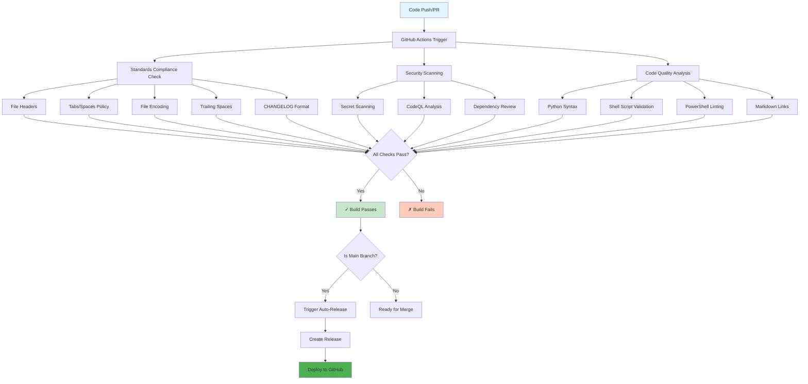
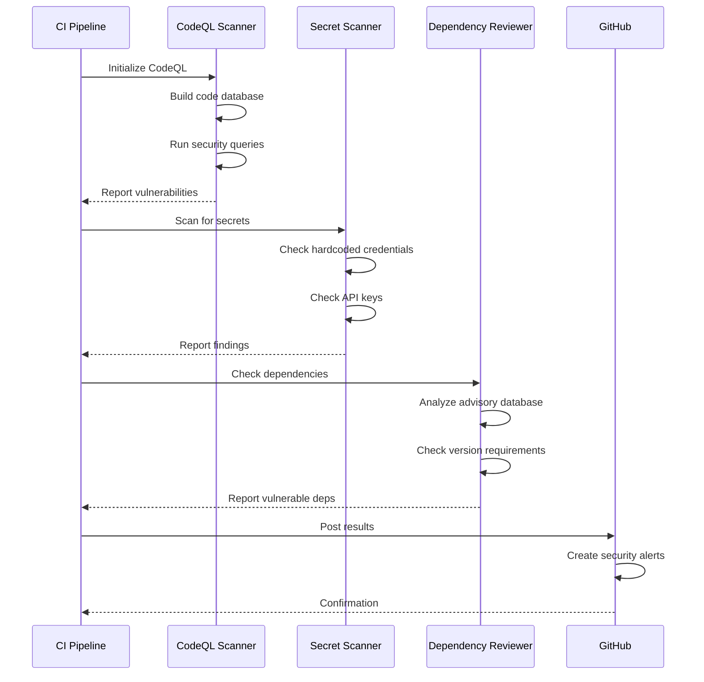
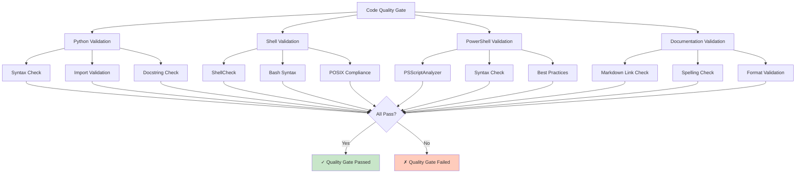
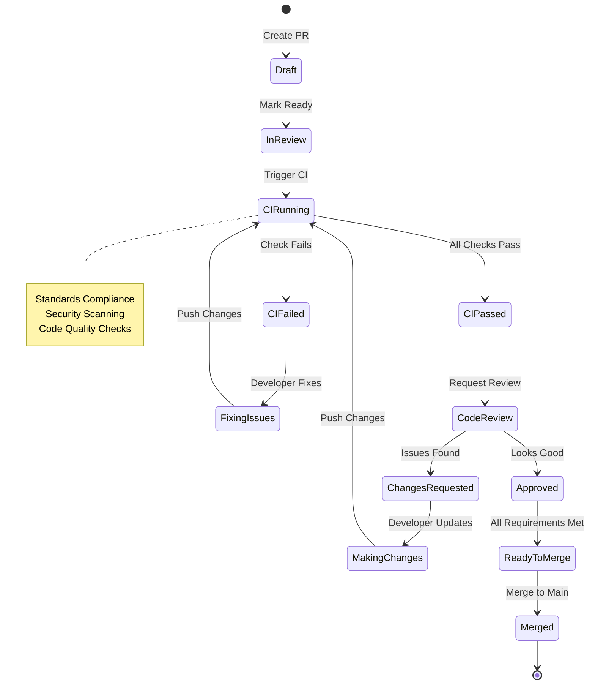
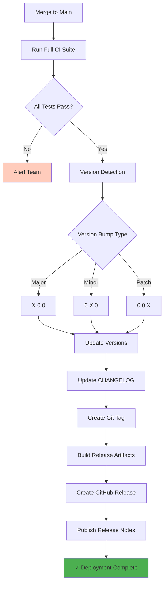
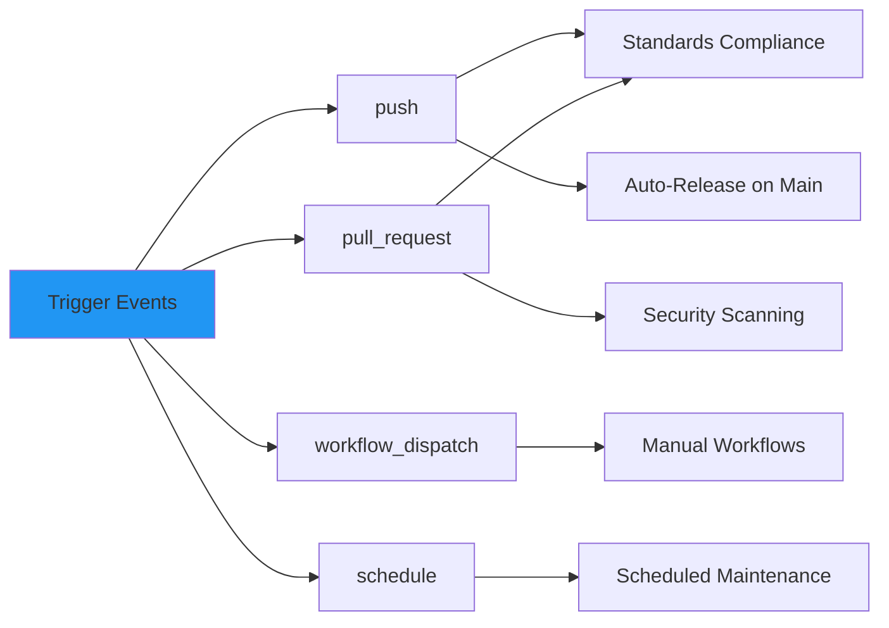

[](https://github.com/mokoconsulting-tech/MokoStandards)

# CI/CD Pipeline

Visual representation of the continuous integration and deployment pipeline in MokoStandards.

## Overview

The CI/CD pipeline automatically validates code quality, security, and compliance on every push and pull request.

## Complete CI/CD Pipeline



## Standards Compliance Workflow

```mermaid
flowchart LR
    A[Start Compliance Check] --> B[File Headers]
    B --> C{Valid Headers?}
    C -->|Yes| D[Check Tabs/Spaces]
    C -->|No| FAIL1[❌ Fail: Missing/Invalid Headers]
    
    D --> E{Correct Indentation?}
    E -->|Yes| F[Check Encoding]
    E -->|No| FAIL2[❌ Fail: Tab/Space Policy Violation]
    
    F --> G{UTF-8 or ASCII?}
    G -->|Yes| H[Check Trailing Spaces]
    G -->|No| FAIL3[❌ Fail: Invalid Encoding]
    
    H --> I{No Trailing Spaces?}
    I -->|Yes| J[Check CHANGELOG]
    I -->|No| FAIL4[❌ Fail: Trailing Spaces Found]
    
    J --> K{[Unreleased] Present?}
    K -->|Yes| PASS[✅ Pass: All Standards Met]
    K -->|No| FAIL5[❌ Fail: Missing [Unreleased]]
    
    style PASS fill:#c8e6c9
    style FAIL1 fill:#ffccbc
    style FAIL2 fill:#ffccbc
    style FAIL3 fill:#ffccbc
    style FAIL4 fill:#ffccbc
    style FAIL5 fill:#ffccbc
```

## Security Scanning Pipeline



## Code Quality Checks



## Pull Request Workflow



## Deployment Flow



## Workflow Triggers



## Related Files

- Workflow: `.github/workflows/standards-compliance.yml`
- Workflow: `.github/workflows/auto-release.yml`
- Workflow: `.github/workflows/codeql.yml`

## See Also

- [Release Workflow](./release-workflow.md)
- [Standards Compliance](./standards-compliance.md)
- [Security Policy](../policy/security/)
