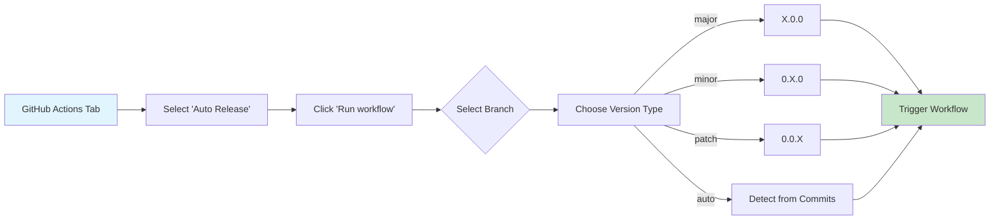
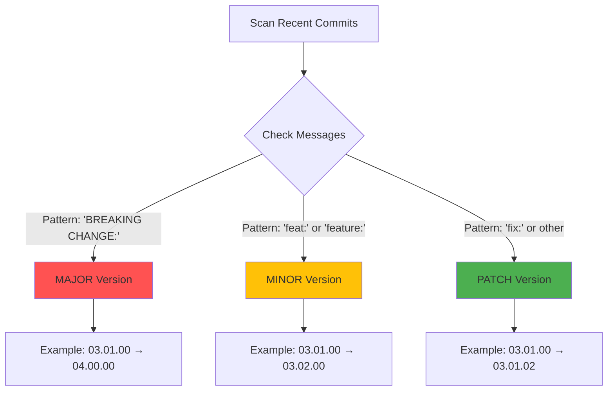
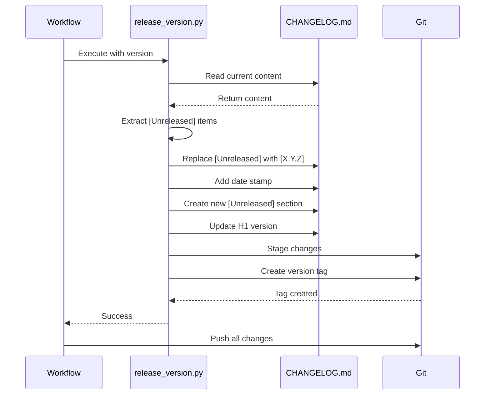
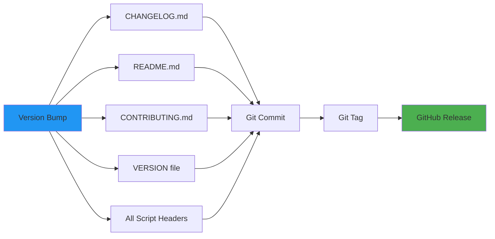

[](https://github.com/mokoconsulting-tech/MokoStandards)

# Release Workflow

Visual representation of the automated release process in MokoStandards.

## Overview

This workflow automat triggers when changes are merged to the `main` branch and automatically creates releases based on commit messages.

## Release Workflow Diagram

```mermaid
flowchart TD
    A[Push to Main Branch] --> B{Check Commit Message}
    B -->|Contains '[skip release]'| Z[Skip Release]
    B -->|No skip marker| C[Analyze Commit Messages]
    
    C --> D{Determine Version Bump}
    D -->|'BREAKING CHANGE:'| E[Major Version]
    D -->|'feat:' or 'feature:'| F[Minor Version]
    D -->|Other commits| G[Patch Version]
    
    E --> H[Update Version Numbers]
    F --> H
    G --> H
    
    H --> I[Update CHANGELOG.md]
    I --> J[Move [Unreleased] to New Version]
    J --> K[Add Date Stamp]
    K --> L[Create New [Unreleased] Section]
    L --> M[Update H1 Version Header]
    
    M --> N[Run release_version.py]
    N --> O[Update VERSION in Files]
    O --> P[Update CONTRIBUTING.md]
    P --> Q[Update README.md]
    
    Q --> R[Create Git Tag]
    R --> S[Push Changes to Repository]
    S --> T[Extract Release Notes]
    T --> U[Create GitHub Release]
    
    U --> V[Attach Release Notes]
    V --> W[Publish Release]
    W --> X[✓ Release Complete]
    
    style A fill:#e1f5ff
    style X fill:#c8e6c9
    style Z fill:#ffccbc
    style E fill:#fff9c4
    style F fill:#fff9c4
    style G fill:#fff9c4
```

## Manual Override

The workflow can also be triggered manually with version override:



## Version Detection Logic



## CHANGELOG Update Process



## File Updates



## Skip Release

To skip automatic release creation, include `[skip release]` anywhere in the commit message:

```bash
git commit -m "docs: Update README [skip release]"
```

## Related Files

- Workflow: `.github/workflows/auto-release.yml`
- Script: `scripts/maintenance/release_version.py`
- Policy: `docs/policy/changelog-standards.md`

## See Also

- [CHANGELOG Standards](../policy/changelog-standards.md)
- [Release Management](../guide/release-management.md)
- [CI/CD Pipeline](./cicd-pipeline.md)
