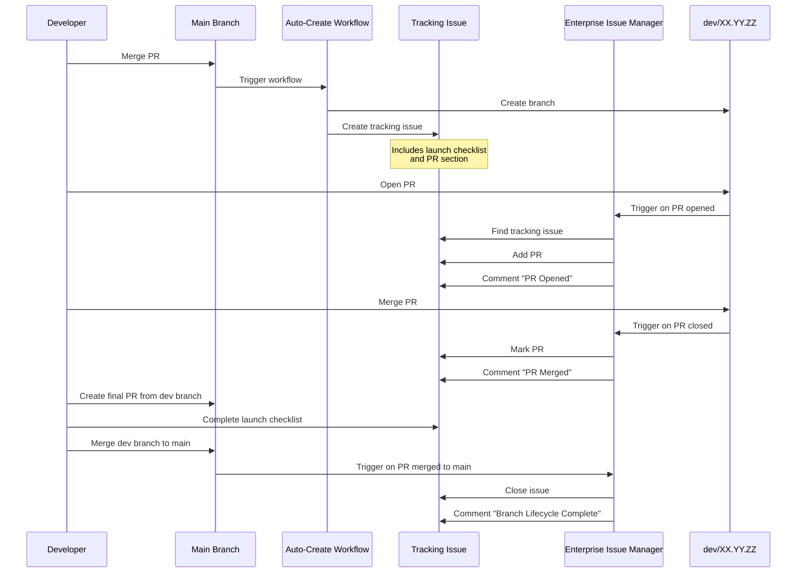

<!--
Copyright (C) 2026 Moko Consulting <hello@mokoconsulting.tech>

SPDX-License-Identifier: GPL-3.0-or-later

# FILE INFORMATION
DEFGROUP: MokoStandards.Documentation
INGROUP: MokoStandards.Workflows
REPO: https://github.com/mokoconsulting-tech/MokoStandards
PATH: /docs/workflows/dev-branch-tracking.md
VERSION: 03.01.01
BRIEF: Dev branch tracking and issue coordination system documentation
-->

# Dev Branch Tracking and Issue Coordination

**Status**: Active | **Version**: 01.00.00 | **Effective**: 2026-02-06

## Overview

This document describes the dev branch tracking and issue coordination system used in MokoStandards. The system automatically creates tracking issues for development branches and coordinates pull requests with those issues throughout the branch lifecycle.

## System Components

The dev branch tracking system consists of three main components:

### 1. Auto-Create Dev Branch Workflow

**File**: `.github/workflows/auto-create-dev-branch.yml`

**Purpose**: Automatically creates development branches and tracking issues when PRs are merged to main.

**Triggers**:
- Pull request merged to `main` branch

**Actions**:
1. Extracts current version from CHANGELOG.md or VERSION file
2. Calculates next patch version (XX.YY.ZZ+1)
3. Creates new `dev/XX.YY.ZZ` branch from main
4. Creates tracking issue with comprehensive launch checklist
5. Assigns issue to `copilot` and `jmiller-moko`
6. Adds labels: `automation`, `version-management`, `dev-branch`

**Tracking Issue Format**:
- Branch details (name, version, creation date)
- Next steps for development
- 10-section launch checklist for merge preparation
- PR tracking section (populated by enterprise-issue-manager)

### 2. Enterprise Issue Manager Workflow

**File**: `.github/workflows/enterprise-issue-manager.yml`

**Purpose**: Coordinates pull requests with dev branch tracking issues throughout the PR lifecycle.

**Triggers**:
- Pull request events: `opened`, `closed`, `reopened`, `ready_for_review`
- Branch deletion events
- Manual workflow dispatch

**Actions for PRs**:

**When PR Opens** (targeting dev/rc branch):
1. Finds the tracking issue for the base branch
2. Adds PR as checklist item in the "📝 Pull Requests" section
3. Comments on the tracking issue with PR details

**When PR Merges** (to dev/rc branch):
1. Updates checklist item from `[ ]` to `[x]` in tracking issue
2. Comments on tracking issue confirming merge

**When PR Merges to Main**:
1. Closes the tracking issue for the merged branch
2. Adds comprehensive closing comment with merge details

**When Branch Deleted**:
1. Finds and closes the tracking issue
2. Adds comment explaining branch deletion

### 3. Dev Branch Tracking Issue Template

**File**: `.github/ISSUE_TEMPLATE/dev-branch-tracking.md`

**Purpose**: Manual creation of tracking issues for dev branches not created by the workflow.

**Use Cases**:
- Manually created dev branches
- Retroactively adding tracking for existing branches
- Custom branch naming outside standard pattern

**Contents**:
- Placeholder fields for branch name and version
- Complete 10-section launch checklist
- PR tracking section
- Labels and assignees pre-configured

## Launch Checklist

All dev branch tracking issues include a comprehensive 10-section launch checklist that must be completed before merging to main:

### 1. Version Management ✅
- Version consistency across all files
- Documentation headers updated
- CHANGELOG.md updated

### 2. Changelog Updates ✅
- All changes documented
- Changes grouped by type (Added, Changed, Fixed, etc.)
- Implementation details included

### 3. Code Review Response ✅
- All review comments addressed
- Requested changes implemented
- Re-review completed for significant changes

### 4. Security Scanning ✅
- CodeQL analysis completed
- Dependency vulnerabilities checked
- Critical issues fixed

### 5. Code Quality ✅
- Linters pass
- Tests passing
- Code coverage meets threshold

### 6. Documentation Updates ✅
- README updated for API changes
- User guides updated
- Examples working

### 7. Drift Detection ✅
- Documentation matches implementation
- File paths correct
- Code examples validated

### 8. Standards Compliance ✅
- File headers correct
- Formatting standards followed
- Semantic versioning followed

### 9. Release Preparation ✅
- Release notes drafted
- Breaking changes documented
- Migration guide prepared if needed

### 10. Final Verification ✅
- All PRs merged
- No blocking issues
- Final PR to main ready

## Workflow Sequence

### Complete Branch Lifecycle



## Usage Examples

### Automatic Workflow

No action required. When a PR is merged to main:

```bash
# Developer merges PR to main via GitHub UI
# Workflow automatically:
# 1. Creates dev/03.02.00 branch
# 2. Creates tracking issue #456
# 3. Assigns to copilot and jmiller-moko
```

### Manual Issue Creation

For manually created dev branches:

1. Navigate to repository Issues
2. Click "New Issue"
3. Select "Dev Branch Tracking" template
4. Fill in the placeholders:
   - Replace `XX.YY.ZZ` with actual version
   - Update branch name in details
   - Add creation date
5. Submit issue

### Working with Tracking Issues

**As a Developer:**

```bash
# 1. Check out the dev branch
git fetch origin
git checkout dev/03.02.00

# 2. Find the tracking issue (labeled 'dev-branch')
# 3. Create PR targeting the dev branch
gh pr create --base dev/03.02.00 --title "Add feature X"

# 4. PR automatically added to tracking issue
# 5. When ready to merge to main, complete checklist in tracking issue
# 6. Create final PR to main
gh pr create --base main --head dev/03.02.00 --title "Release 03.02.00"
```

**As a Reviewer:**

1. Review PR targeting dev branch
2. Check tracking issue for context
3. Verify checklist items as they're completed
4. Before approving final PR to main, verify all checklist items are complete

## Integration with Other Workflows

### Pre-Merge Checklist Policy

The launch checklist aligns with the [Copilot Pre-Merge Checklist Policy](../policy/copilot-pre-merge-checklist.md):

- Same 8 core sections
- Additional 2 sections specific to branch merges
- Reference link included in every tracking issue

### Standards Compliance Workflow

The "Standards Compliance" checklist section integrates with:
- `.github/workflows/standards-compliance.yml`
- File header validation
- Formatting standards checks

### Security Workflows

The "Security Scanning" checklist section integrates with:
- CodeQL security analysis
- Dependency review workflow
- Secret scanning

## Configuration

### Assignees

Default assignees for tracking issues:
- `copilot` (GitHub Copilot agent)
- `jmiller-moko` (Primary maintainer)

To change assignees:
- **Auto-created issues**: Edit `.github/workflows/auto-create-dev-branch.yml` line 289
- **Manual template**: Edit `.github/ISSUE_TEMPLATE/dev-branch-tracking.md` line 6

### Labels

Default labels for tracking issues:
- `automation` - Automated process
- `version-management` - Version tracking
- `dev-branch` - Development branch marker

To change labels:
- **Auto-created issues**: Edit `.github/workflows/auto-create-dev-branch.yml` line 288
- **Manual template**: Edit `.github/ISSUE_TEMPLATE/dev-branch-tracking.md` line 5

### Branch Patterns

The system tracks branches matching:
- `dev/*` - Development branches
- `rc/*` - Release candidate branches

To modify patterns, edit `.github/workflows/enterprise-issue-manager.yml` line 143.

## Troubleshooting

### Tracking Issue Not Found

**Symptom**: PR opened but not linked to tracking issue

**Causes**:
1. Branch name doesn't match pattern (`dev/*` or `rc/*`)
2. Tracking issue doesn't exist
3. Tracking issue missing `dev-branch` label

**Solution**:
1. Verify branch name starts with `dev/` or `rc/`
2. Check if tracking issue exists with label `dev-branch`
3. Manually create issue using template if needed

### PR Not Added to Tracking Issue

**Symptom**: PR opened but not appearing in tracking issue

**Causes**:
1. Tracking issue has non-standard format
2. Missing "📝 Pull Requests" section
3. Workflow error (check Actions tab)

**Solution**:
1. Check workflow run in Actions tab for errors
2. Manually add PR to tracking issue: `- [ ] #123 - PR Title (@author)`
3. Ensure tracking issue has "📝 Pull Requests" section

### Tracking Issue Not Closing

**Symptom**: Dev branch merged to main but issue still open

**Causes**:
1. Branch name mismatch in issue body
2. Workflow not triggered on merge
3. Issue manually closed earlier

**Solution**:
1. Verify issue body contains correct branch name in backticks
2. Check Actions tab for workflow run on merge
3. Manually close issue if workflow didn't run

## Best Practices

### For Maintainers

1. **Monitor tracking issues** - Review open dev-branch issues regularly
2. **Complete checklists** - Don't skip checklist items before merging to main
3. **Update assignees** - Add relevant team members to tracking issues
4. **Link related issues** - Reference related issues in tracking issue comments

### For Contributors

1. **Check tracking issue** - Review before creating PR to dev branch
2. **Follow checklist** - Use checklist as guide for PR requirements
3. **Update status** - Comment on tracking issue with progress updates
4. **Test thoroughly** - Verify all checklist items apply to your changes

### For CI/CD

1. **Status checks** - Reference tracking issue in PR descriptions
2. **Automated tests** - Run tests mentioned in checklist automatically
3. **Quality gates** - Block merge if checklist items incomplete
4. **Documentation** - Auto-generate release notes from tracking issues

## Related Documentation

- [Copilot Pre-Merge Checklist Policy](../policy/copilot-pre-merge-checklist.md)
- [Auto-Create Dev Branch Workflow](../../.github/workflows/auto-create-dev-branch.yml)
- [Enterprise Issue Manager Workflow](../../.github/workflows/enterprise-issue-manager.yml)
- [Dev Branch Tracking Template](../../.github/ISSUE_TEMPLATE/dev-branch-tracking.md)
- [Workflow Architecture](./workflow-architecture.md)
- [Contributing Guide](../../CONTRIBUTING.md)

## Changelog

| Version | Date | Changes |
|---------|------|---------|
| 01.00.00 | 2026-02-06 | Initial documentation of dev branch tracking system |
